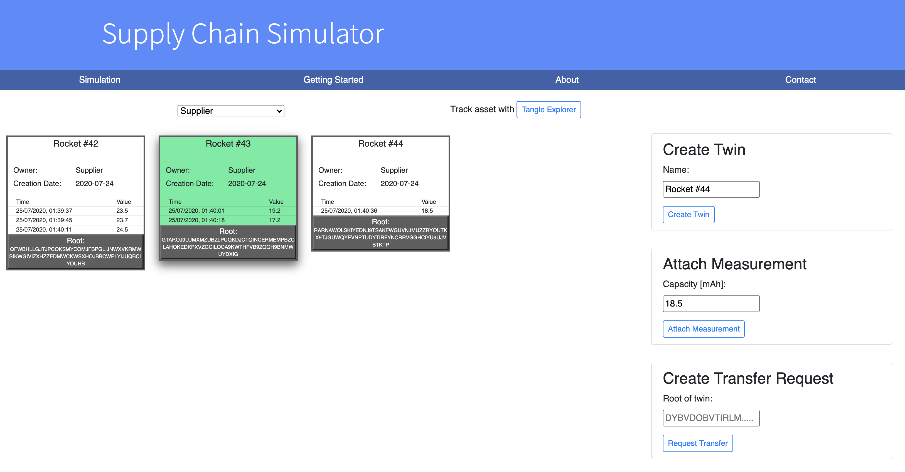

# Supply Chain Simulator

> Small supply chain / digital twin simulator and playground



## Developer Guide

### Dev

``` bash
# install dependencies
npm install

# serve with hot reload at localhost:8080
npm run dev
```

### Prod

``` bash
# install dependencies
npm install

# serve with hot reload at localhost:8080 on your server
npm run serve
```

Best served with nginx.


## Backlog

Planned
- transfer asset
- "dissmiss" state transmission.
- filter dashboard (dismissed=?, owner=?, )
- listen on assets (maybe it works for non-author posts -> auto transfer)
- refactor
- efficient data handling with the tangle
- ownership graph.
- exchange view in overview (if it origins from another twin instance)
- Chronicle for persistent data

Planned B (if the client library gets obsolete with the Chrysalis update)
- Make rust streams implementation as api server.
- Bonus: __Industry Monitor__ possible
    1. implementing node_exporter
    2. prometheus production dashboard
    3. Prometheus alarm via appropiate promql (richer in information than simply treshold)

